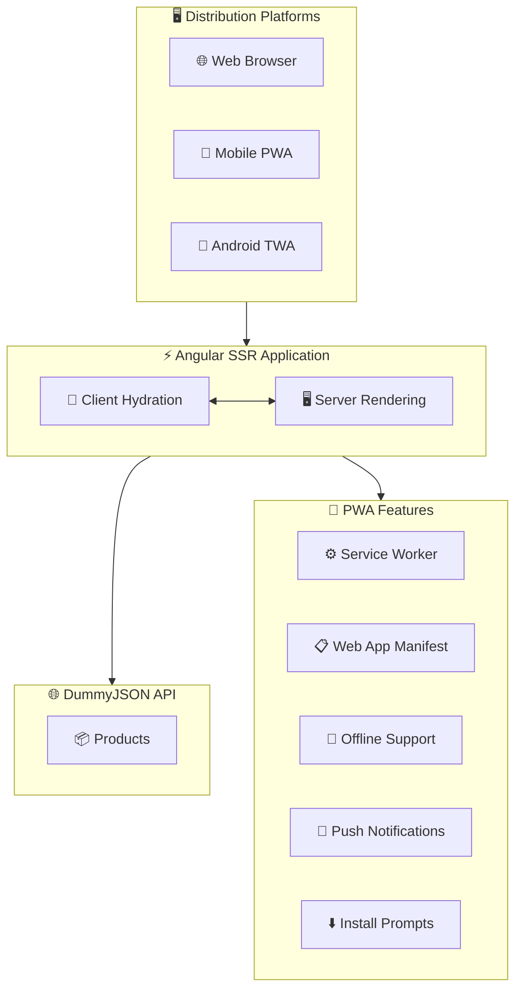
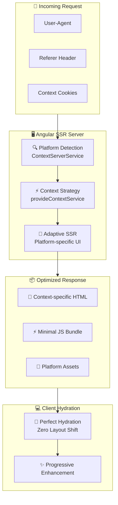

# Angular SSR PWA with Trusted Web Activity (TWA)

## Description

This repository provides a practical guide to building a **Progressive Web Application (PWA)** with **Server-Side Rendering (SSR)** using **Angular**, and packaging it as a **Trusted Web Activity (TWA)** for Android. The project features an adaptive architecture optimized for both web and mobile devices.

## Table of Contents

- [Requirements](#requirements)
- [Project Architecture](#project-architecture)
- [Project Structure](#project-structure)
- [Features](#features)
- [Configuration](#configuration)
- [Development](#development)
- [TWA Generation](#twa-generation)

## Requirements

- Node.js 20+
- Angular CLI v20+
- Bubblewrap
- Android Studio (for TWA)
- Chrome DevTools

## Project Architecture

The project architecture is designed to be modular, scalable, and optimized for multiple platforms:



### Components

- **Angular SSR**:
  - Server-side rendering for improved SEO and initial load time
  - Hydration for a seamless user experience
  - Optimized consumption of DummyJSON API through SSR

- **DummyJSON API Integration**:
  - Provides fake data for development and testing
  - Includes endpoints for products, users, posts, comments, todos, etc.
  - No local backend setup required

- **PWA Core**:
  - Service Worker for smart caching and offline capabilities
  - Web App Manifest for native installation support
  - Adaptive caching strategies for API responses

- **Trusted Web Activity (TWA)**:
  - Packaged as a native Android app
  - Full integration with the Android ecosystem
  - Native-like experience without browser chrome

- **Adaptive Design**:
  - Responsive design optimized for multiple devices
  - Device capability detection
  - Conditional resource loading

## Project Structure

```
ng-ssr-twa-adaptive/
├── src/
│   ├── app/                   # Main Angular Application
│   │   ├── core/              # Core constants, resolvers, guards
│   │   ├── shared/            # Shared components and modules
│   │   ├── layout/            # Platform-based layout
│   │   └── pages/             # Main pages
│   │   └── services/          # Application services
│   ├── public/
│   │   └── manifest.webmanifest # Web App Manifest
│   ├── environments/          # Environment configurations
├── android/                   # TWA Android Project
```

## Features

### 🚀 Performance

- **Server-Side Rendering** for optimized initial load
- **Code Splitting** by routes
- **Lazy Loading** for modules
- **Tree Shaking** for minimal bundle size

### 📱 Progressive Web App

- **Service Worker** with caching strategies
- **Full offline support**
- **Native push notifications**
- **Smart install prompts**

### 🤖 Android Integration

- **Trusted Web Activity** for a native experience
- **Play Store distribution ready**

### 🎨 Adaptive UI/UX

- **Responsive mobile-first design**
- **Touch-friendly interactions**

## Configuration

### Environment Setup

Edit your environment files in `src/environments/`:

```typescript
export const environment = {
  API: "https://dummyjson.com",
  WEB_URL: "http://localhost:4200",
  twaConfig: {
    production: false,
  },
  httpCache: {
    /**
     * maxAge of cache in milliseconds
     */
    maxAge: 60_0000,
    /**
     * Maximum number of unique caches (different parameters)
     */
    maxCacheCount: 100,
  },
};
```

### Web App Manifest

`src/manifest.json` is configured for optimal PWA installation:

```json
{
  "name": "Angular SSR TWA App",
  "short_name": "NgSSRTWA",
  "theme_color": "#1976d2",
  "background_color": "#fafafa",
  "display": "standalone",
  "start_url": "/",
  "icons": [...]
}
```

## Development

### Development Server

Run the development server:

```bash
ng serve
```

### Build

Build the production-ready version:

```bash
ng build --configuration production
```

## Trusted Web Activity (TWA) - Context-Aware Architecture

### Problem Solved

Traditionally, developing for multiple platforms required:

- **3 separate codebases**: Web, PWA, and native app
- **3 development teams**: Frontend, Mobile Web, Android
- **Feature fragmentation**: Inconsistent experiences

### Solution: Context-Aware SSR

This project implements a **context-aware architecture** that detects the platform **from the server** and renders an optimized experience accordingly — maintaining a single Angular codebase.



#### 🧠 **Zero Hydration Mismatch**

- Server renders **exactly** the UI expected by the client
- Eliminates layout shifts
- Ensures perfect hydration without re-renders

### Context Detection Logic

The system automatically detects the execution context using multiple strategies:

#### **🔍 Server-Side Detection**

- **Referer Analysis**: `android-app://` indicates TWA origin
- **User-Agent Parsing**: Detects PWA/TWA patterns
- **Cookie Persistence**: Maintains context across navigations

#### **📱 Client-Side Enhancement**

- **Document.referrer** validation
- **navigator.userAgent** parsing
- **Navigator API** for hardware-specific optimizations

### Digital Asset Links & Security

```json
// .well-known/assetlinks.json
[
  {
    "relation": ["delegate_permission/common.handle_all_urls"],
    "target": {
      "namespace": "android_app",
      "package_name": "com.yourapp.twa",
      "sha256_cert_fingerprints": ["YOUR_CERT_FINGERPRINT"]
    }
  }
]
```

### Analytics & Monitoring

```typescript
export class AnalyticsService {
  trackContextSpecificEvent(event: string, data: any) {
    const context = this.contextService.getContext();

    gtag("event", event, {
      ...data,
      context_type: context,
    });
  }
}
```

### Ideal Use Cases

#### **🛒 E-commerce**

- **Web**: Full experience with product comparison
- **PWA**: Offline shopping and notifications
- **TWA**: Native-like payment integration

#### **📰 Media & Content**

- **Web**: Rich layout with multiple sections
- **PWA**: Offline reading and syncing
- **TWA**: Immersive reading experience

### Competitive Advantages

#### **vs. Traditional Multi-Platform Development**

- ✅ Less code duplication
- ✅ Shorter development time
- ✅ Guaranteed consistency
- ✅ Unified deployment

#### **vs. Responsive Design**

- ✅ Context-aware bundle optimization
- ✅ Native UX for TWA
- ✅ Server-side platform optimization
- ✅ Zero layout shift guarantee

This architecture represents the **next evolution of modern web development**, where a single Angular app can deliver optimized native-like experiences across web, PWA, and Android — maximizing performance and simplicity.

## TWA Generation

### Prerequisites

Ensure the following tools are installed:

```bash
npm install -g @bubblewrap/cli
bubblewrap --version
```

Additional requirements:

- Android Studio configured
- JDK 8 or later
- Android SDK tools installed

### Generation Process

#### 1. **Validate Web App Manifest**

```bash
curl -I https://ng-ssr-twa-adaptive.vercel.app/manifest.webmanifest
```

#### 2. **Initialize TWA Project**

```bash
bubblewrap init --manifest=https://ng-ssr-twa-adaptive.vercel.app/manifest.webmanifest
```

#### 3. **Context-Aware Configuration**

Set the start URL to enable context-aware detection:

```bash
Start URL: /?ctx=twa
```

#### 4. **Configure Digital Asset Links**

Ensure `.well-known/assetlinks.json` is properly configured.

#### 5. **Generate APK**

```bash
bubblewrap build
bubblewrap build --release
```

### Advanced Configurations

#### **Custom Context Parameter**

```typescript
// If changed from 'ctx=twa' to 'ctx=android'
// update Start URL accordingly
```

### Deployment & Testing

#### **Local Testing**

```bash
adb install app-release-signed.apk
chrome://inspect/#devices
```

#### **Context Validation**

1. Open the TWA on an Android device
2. Confirm optimized native UI rendering
3. Validate analytics tracking `context = 'twa'`

### Additional Resources

- [Google Codelabs - PWA to Play Store](https://developers.google.com/codelabs/pwa-in-play)
- [Bubblewrap Documentation](https://github.com/GoogleChromeLabs/bubblewrap)
- [Digital Asset Links](https://developers.google.com/digital-asset-links)
- [TWA Best Practices](https://web.dev/trusted-web-activity/)

