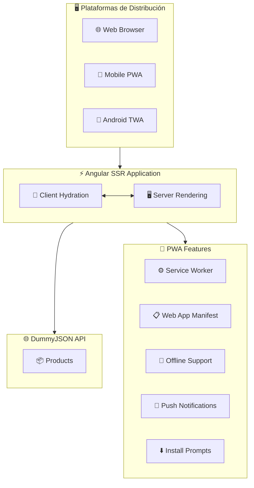

# Angular SSR PWA con Trusted Web Activity (TWA)
 
## Descripción

Este repositorio es una guía práctica para implementar una **Progressive Web Application (PWA)** con **Server-Side Rendering (SSR)** utilizando **Angular** y su posterior empaquetado como **Trusted Web Activity (TWA)** para Android. El proyecto incluye una arquitectura adaptativa que optimiza el rendimiento tanto en web como en dispositivos móviles.

## Tabla de Contenidos

- [Requisitos](#requisitos)
- [Arquitectura del Proyecto](#arquitectura-del-proyecto)
- [Estructura del Proyecto](#estructura-del-proyecto)
- [Características](#características)
- [Configuración](#configuración)
- [Desarrollo](#desarrollo)

## Requisitos

- Node.js 20+
- Angular CLI v20+
- Bubblewrap
- Android Studio (para TWA)
- Chrome DevTools

## Arquitectura del Proyecto

La arquitectura del proyecto está diseñada para ser modular, escalable y optimizada para múltiples plataformas:



### Componentes

- **Angular SSR**:

  - Renderizado del lado del servidor para mejorar SEO y tiempo de carga inicial
  - Hidratación para una experiencia fluida
  - Consumo optimizado de DummyJSON API con SSR

- **DummyJSON API Integration**:

  - API externa que proporciona datos fake para desarrollo y testing
  - Endpoints para productos, usuarios, posts, comentarios, todos, etc.
  - No requiere configuración de backend local

- **PWA Core**:

  - Service Worker para caché inteligente y funcionalidad offline
  - Web App Manifest para instalación nativa
  - Estrategias de caché adaptativas para API responses

- **Trusted Web Activity (TWA)**:

  - Empaquetado como aplicación Android nativa
  - Integración completa con el ecosistema Android
  - Experiencia de aplicación nativa sin browser chrome

- **Adaptive Design**:
  - Responsive design optimizado para múltiples dispositivos
  - Detección de capacidades del dispositivo
  - Carga condicional de recursos

## Estructura del Proyecto

```
ng-ssr-twa-adaptive/
├── src/
│   ├── app/                   # Aplicación Angular principal
│   │   ├── core/              # Constantes core , resolvers , guards
│   │   ├── shared/            # Componentes y módulos compartidos
│   │   ├── layout/            # Layout base por plataforma
│   │   └── pages/             # Páginas principales
│   │   └── services/          # Servicios de la aplicación
│   ├── public/
│   │   └── manifest.webmanifest # Web App Manifest
│   ├── environments/          # Configuraciones de entorno
├── android/                   # Proyecto TWA para Android
```

## Características

### 🚀 Performance

- **Server-Side Rendering** para carga inicial optimizada
- **Code Splitting** automático por rutas
- **Lazy Loading** de módulos
- **Tree Shaking** para bundle size mínimo

### 📱 Progressive Web App

- **Service Worker** con estrategias de caché 
- **Offline functionality** completa
- **Push notifications** nativas
- **App install prompts** inteligentes

### 🤖 Android Integration

- **Trusted Web Activity** para experiencia nativa
- **Play Store distribution** ready

### 🎨 Adaptive UI/UX

- **Responsive design** mobile-first
- **Touch-friendly** interactions

## Configuración

### Configuración de Entornos

Configura los archivos en `src/environments/`:

```typescript
export const environment = {
  API: 'https://dummyjson.com',
  WEB_URL: 'http://localhost:4200',
  twaConfig: {
    production: false,
  },
  httpCache: {
    /**
     * maxAge of cache in milliseconds
     */
    maxAge: 60_0000,
    /**
     * max cacheCount for different parameters
     * maximum allowed unique caches (different parameters)
     */
    maxCacheCount: 100,
  },
};

```

 
### Web App Manifest

El archivo `src/manifest.json` está configurado para optimizar la instalación PWA:

```json
{
  "name": "Angular SSR TWA App",
  "short_name": "NgSSRTWA",
  "theme_color": "#1976d2",
  "background_color": "#fafafa",
  "display": "standalone",
  "start_url": "/",
  "icons": [...]
}
```

## Desarrollo

### Servidor de Desarrollo

Para iniciar el servidor de desarrollo:

```bash
ng serve
```

## Generar Build
Para generar la build productiva con el siguiente comando:

```bash
ng build --configuration production
```
