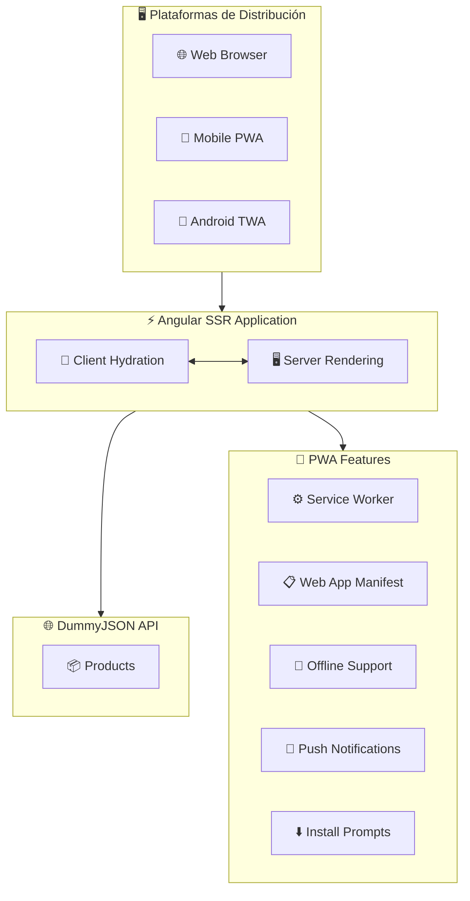
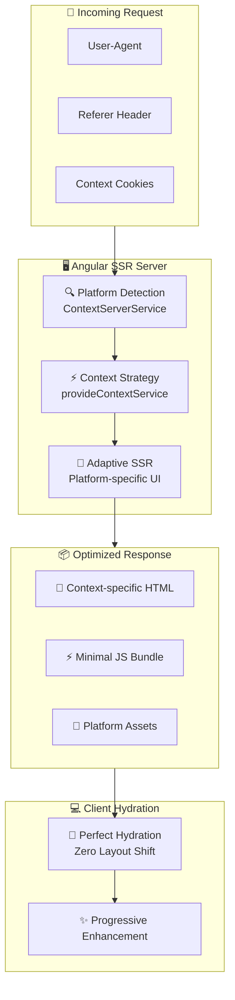

# Angular SSR PWA con Trusted Web Activity (TWA)

## Descripción

Este repositorio es una guía práctica para implementar una **Progressive Web Application (PWA)** con **Server-Side Rendering (SSR)** utilizando **Angular** y su posterior empaquetado como **Trusted Web Activity (TWA)** para Android. El proyecto incluye una arquitectura adaptativa que optimiza el rendimiento tanto en web como en dispositivos móviles.

## Tabla de Contenidos

- [Requisitos](#requisitos)
- [Arquitectura del Proyecto](#arquitectura-del-proyecto)
- [Estructura del Proyecto](#estructura-del-proyecto)
- [Características](#características)
- [Configuración](#configuración)
- [Desarrollo](#desarrollo)
- [TWA](#generar-twa)

## Requisitos

- Node.js 20+
- Angular CLI v20+
- Bubblewrap
- Android Studio (para TWA)
- Chrome DevTools

## Arquitectura del Proyecto

La arquitectura del proyecto está diseñada para ser modular, escalable y optimizada para múltiples plataformas:



### Componentes

- **Angular SSR**:

  - Renderizado del lado del servidor para mejorar SEO y tiempo de carga inicial
  - Hidratación para una experiencia fluida
  - Consumo optimizado de DummyJSON API con SSR

- **DummyJSON API Integration**:

  - API externa que proporciona datos fake para desarrollo y testing
  - Endpoints para productos, usuarios, posts, comentarios, todos, etc.
  - No requiere configuración de backend local

- **PWA Core**:

  - Service Worker para caché inteligente y funcionalidad offline
  - Web App Manifest para instalación nativa
  - Estrategias de caché adaptativas para API responses

- **Trusted Web Activity (TWA)**:

  - Empaquetado como aplicación Android nativa
  - Integración completa con el ecosistema Android
  - Experiencia de aplicación nativa sin browser chrome

- **Adaptive Design**:
  - Responsive design optimizado para múltiples dispositivos
  - Detección de capacidades del dispositivo
  - Carga condicional de recursos

## Estructura del Proyecto

```
ng-ssr-twa-adaptive/
├── src/
│   ├── app/                   # Aplicación Angular principal
│   │   ├── core/              # Constantes core , resolvers , guards
│   │   ├── shared/            # Componentes y módulos compartidos
│   │   ├── layout/            # Layout base por plataforma
│   │   └── pages/             # Páginas principales
│   │   └── services/          # Servicios de la aplicación
│   ├── public/
│   │   └── manifest.webmanifest # Web App Manifest
│   ├── environments/          # Configuraciones de entorno
├── android/                   # Proyecto TWA para Android
```

## Características

### 🚀 Performance

- **Server-Side Rendering** para carga inicial optimizada
- **Code Splitting** automático por rutas
- **Lazy Loading** de módulos
- **Tree Shaking** para bundle size mínimo

### 📱 Progressive Web App

- **Service Worker** con estrategias de caché
- **Offline functionality** completa
- **Push notifications** nativas
- **App install prompts** inteligentes

### 🤖 Android Integration

- **Trusted Web Activity** para experiencia nativa
- **Play Store distribution** ready

### 🎨 Adaptive UI/UX

- **Responsive design** mobile-first
- **Touch-friendly** interactions

## Configuración

### Configuración de Entornos

Configura los archivos en `src/environments/`:

```typescript
export const environment = {
  API: "https://dummyjson.com",
  WEB_URL: "http://localhost:4200",
  twaConfig: {
    production: false,
  },
  httpCache: {
    /**
     * maxAge of cache in milliseconds
     */
    maxAge: 60_0000,
    /**
     * max cacheCount for different parameters
     * maximum allowed unique caches (different parameters)
     */
    maxCacheCount: 100,
  },
};
```

### Web App Manifest

El archivo `src/manifest.json` está configurado para optimizar la instalación PWA:

```json
{
  "name": "Angular SSR TWA App",
  "short_name": "NgSSRTWA",
  "theme_color": "#1976d2",
  "background_color": "#fafafa",
  "display": "standalone",
  "start_url": "/",
  "icons": [...]
}
```

## Desarrollo

### Servidor de Desarrollo

Para iniciar el servidor de desarrollo:

```bash
ng serve
```

## Generar Build
Para generar la build productiva con el siguiente comando:

```bash
ng build --configuration production
```

## Trusted Web Activity (TWA) - Context-Aware Architecture

### El Problema Resuelto

Tradicionalmente, desarrollar para múltiples plataformas requería:

- **3 codebases separados**: Web, PWA, y aplicación nativa
- **3 equipos de desarrollo**: Frontend, Mobile Web, Android
- **Fragmentación de features**: Inconsistencias entre experiencias

### La Solución: Context-Aware SSR

Este proyecto implementa una **arquitectura context-aware revolucionaria** que detecta la plataforma de origen **desde el servidor** y renderiza la experiencia optimizada específica, manteniendo un único codebase Angular.



#### 🧠 **Zero Hydration Mismatch**

- Server renderiza **exactamente** la misma UI que el cliente espera
- Eliminación completa de layout shifts
- Hydratación perfecta sin re-renders

### Context Detection Logic

El sistema detecta automáticamente el contexto de ejecución mediante múltiples estrategias:

#### **🔍 Server-Side Detection**

- **Referer Analysis**: `android-app://` indica TWA origin
- **User-Agent Parsing**: Patrones específicos de PWA/TWA
- **Cookie Persistence**: Mantiene contexto entre navegaciones

#### **📱 Client-Side Enhancement**

- **Document.referrer**: Validación client-side
- **Window.matchMedia**: Detección de capabilities
- **Navigator API**: Hardware-specific optimizations

### Digital Asset Links & Security

```json
// .well-known/assetlinks.json - Validación de propiedad
[
  {
    "relation": ["delegate_permission/common.handle_all_urls"],
    "target": {
      "namespace": "android_app",
      "package_name": "com.yourapp.twa",
      "sha256_cert_fingerprints": ["YOUR_CERT_FINGERPRINT"]
    }
  }
]
```

### Analytics & Monitoring Diferenciado

```typescript
// Tracking context-aware para insights únicos
export class AnalyticsService {
  trackContextSpecificEvent(event: string, data: any) {
    const context = this.contextService.getContext();

    gtag("event", event, {
      ...data,
      context_type: context,
    });
  }
}
```

### Casos de Uso Ideales

#### **🛒 E-commerce**

- **Web**: Experiencia completa con comparación de productos
- **PWA**: Optimizada para compras offline y notificaciones
- **TWA**: Experiencia nativa con integración de pagos Android

#### **📰 Media & Content**

- **Web**: Layout expansivo con sidebar y múltiples secciones
- **PWA**: Lectura offline y sincronización de contenido
- **TWA**: Experiencia inmersiva sin distracciones del browser

### Ventajas Competitivas

#### **vs. Desarrollo Tradicional Multi-Platform**

- ✅ **menos** código duplicado
- ✅ **menos** tiempo de desarrollo
- ✅ **Consistencia** garantizada entre plataformas
- ✅ **Deployment único** para todas las experiencias

#### **vs. Responsive Design**

- ✅ **Bundle optimization** por contexto
- ✅ **Native UX** en TWA sin compromisos
- ✅ **Server-side optimization** específica
- ✅ **Zero layout shift** guarantee

Esta arquitectura representa la **evolución natural del desarrollo web moderno**, donde una sola aplicación Angular puede ofrecer experiencias nativas optimizadas para web, PWA, y aplicaciones Android, manteniendo la simplicidad del desarrollo y maximizando el performance en cada contexto.


## Generar TWA (Trusted Web Activity)

### Prerrequisitos

Antes de generar la TWA, asegúrate de tener instaladas las siguientes herramientas:

```bash
# Instalar Bubblewrap CLI globalmente
npm install -g @bubblewrap/cli

# Verificar instalación
bubblewrap --version
```

**Requisitos adicionales:**
- Android Studio instalado y configurado
- Java Development Kit (JDK) 8 o superior
- Android SDK configurado con las herramientas de build

### Proceso de Generación

#### 1. **Validar Web App Manifest**

Verifica que el manifest esté correctamente desplegado y accesible:

```bash
# Validar manifest en producción
curl -I https://ng-ssr-twa-adaptive.vercel.app/manifest.webmanifest
```

**URL de validación:** https://ng-ssr-twa-adaptive.vercel.app/manifest.webmanifest

#### 2. **Inicializar Proyecto TWA**

```bash
# Crear el proyecto TWA con el manifest
bubblewrap init --manifest=https://ng-ssr-twa-adaptive.vercel.app/manifest.webmanifest
```

#### 3. **Configuración Context-Aware**

**Aspecto Crítico:** Configura la URL de inicio para aprovechar la arquitectura context-aware:

```bash
# Durante la inicialización, configurar:
Start URL: /?ctx=twa
```

Esta configuración permite que:
- El servidor detecte automáticamente el contexto TWA
- Se renderice la UI optimizada para experiencia nativa
- Se apliquen las optimizaciones específicas de Android

#### 4. **Configurar Digital Asset Links**

Asegúrate de que el archivo `.well-known/assetlinks.json` esté correctamente configurado en tu dominio para establecer la relación de confianza entre la app web y la TWA.

#### 5. **Generar APK**

```bash
# Construir la aplicación Android
bubblewrap build

# Para builds de release (Google Play)
bubblewrap build --release
```

### Configuraciones Avanzadas

#### **Personalización del Context Parameter**

Si modificas el parámetro de contexto en el `ContextService`, actualiza correspondientemente la URL de inicio:

```typescript
// Si cambias en el service de: 'ctx=twa' a 'context=android'
// Actualiza la Start URL a: /?context=android
```

### Deployment y Testing

#### **Testing Local**

```bash
# Instalar APK en dispositivo/emulador
adb install app-release-signed.apk

# Debug con Chrome DevTools
chrome://inspect/#devices
```

#### **Validación de Contexto**

Verifica que la detección funcione correctamente:
1. Abrir la TWA en dispositivo Android
2. Verificar que se muestre la UI optimizada para contexto nativo
3. Confirmar que analytics trackee correctamente el contexto 'twa'

### Recursos Adicionales

- * [Google Codelabs - PWA to Play Store](https://developers.google.com/codelabs/pwa-in-play)**
- **[Bubblewrap Documentation](https://github.com/GoogleChromeLabs/bubblewrap)**
- **[Digital Asset Links](https://developers.google.com/digital-asset-links)**
- **[TWA Best Practices](https://web.dev/trusted-web-activity/)**